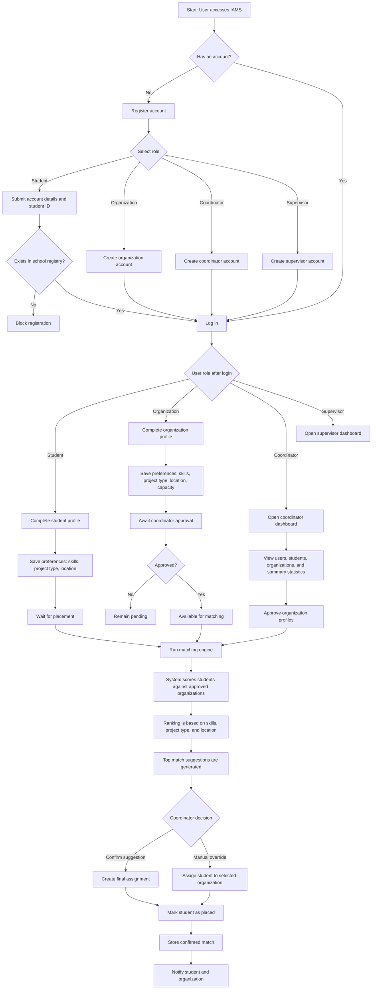

# IAMS Lecturer-Ready System Flow

This diagram gives a clean high-level view of how the Industrial Attachment Management System works.

```mermaid
flowchart TD
    A["Start: User accesses IAMS"] --> B{"Has an account?"}

    B -->|No| C["Register account"]
    B -->|Yes| D["Log in"]

    C --> E{"Select role"}
    E -->|Student| F["Submit account details and student ID"]
    E -->|Organization| G["Create organization account"]
    E -->|Coordinator| H["Create coordinator account"]
    E -->|Supervisor| I["Create supervisor account"]

    F --> J{"Exists in school registry?"}
    J -->|No| K["Block registration"]
    J -->|Yes| D

    G --> D
    H --> D
    I --> D

    D --> L{"User role after login"}

    L -->|Student| M["Complete student profile"]
    M --> N["Save preferences: skills, project type, location"]
    N --> O["Wait for placement"]

    L -->|Organization| P["Complete organization profile"]
    P --> Q["Save preferences: skills, project type, location, capacity"]
    Q --> R["Await coordinator approval"]
    R --> S{"Approved?"}
    S -->|No| T["Remain pending"]
    S -->|Yes| U["Available for matching"]

    L -->|Coordinator| V["Open coordinator dashboard"]
    V --> W["View users, students, organizations, and summary statistics"]
    W --> X["Approve organization profiles"]
    X --> Y["Run matching engine"]

    O --> Y
    U --> Y

    Y --> Z["System scores students against approved organizations"]
    Z --> AA["Ranking is based on skills, project type, and location"]
    AA --> AB["Top match suggestions are generated"]

    AB --> AC{"Coordinator decision"}
    AC -->|Confirm suggestion| AD["Create final assignment"]
    AC -->|Manual override| AE["Assign student to selected organization"]

    AD --> AF["Mark student as placed"]
    AE --> AF

    AF --> AG["Store confirmed match"]
    AG --> AH["Notify student and organization"]

    L -->|Supervisor| AI["Open supervisor dashboard"]
```
